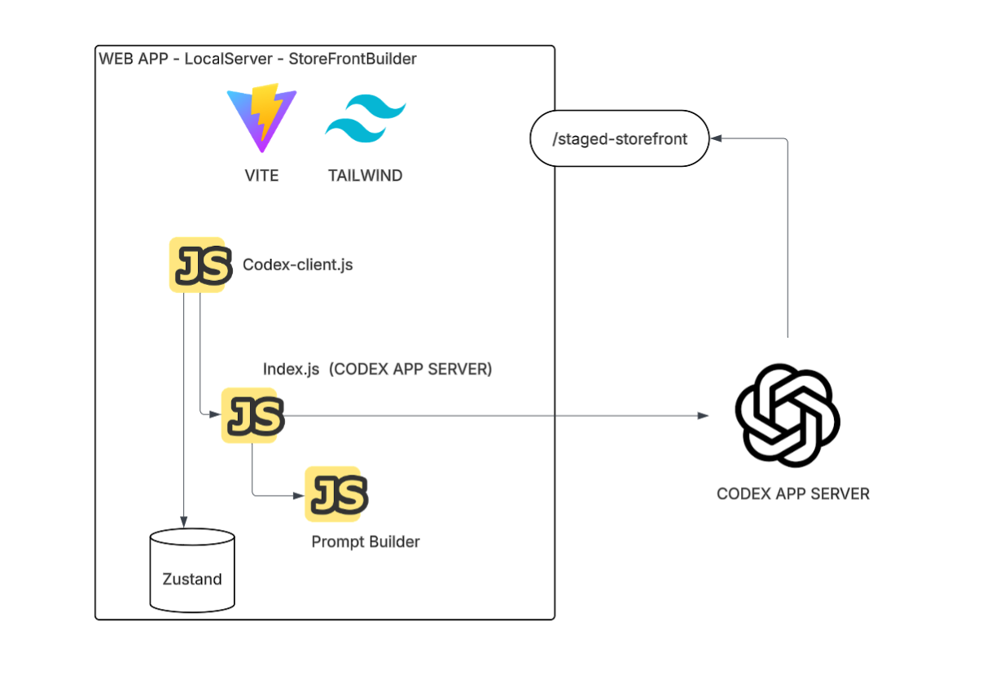
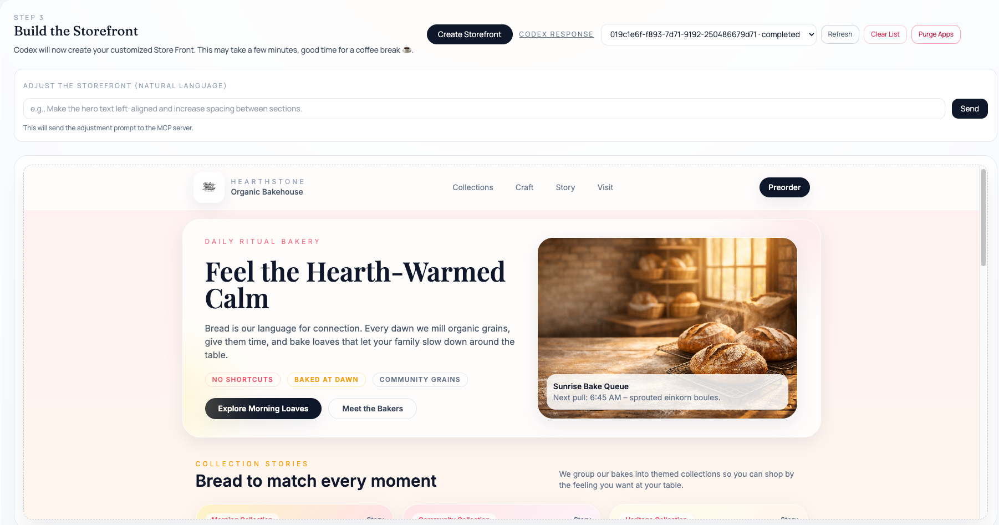

# Storefront Builder (Codex)

Builds a branded storefront by combining asset packs with natural‑language prompts, then stages the result inside the running Vite app.



## Demo video
_(Add demo video here)_  

## Example generated page


## What the app does
- Step 1: Choose an asset package (logo, hero, products 1–3, about). The grid previews all assets.
- Step 2: Provide natural‑language guidance (mission, what’s special, UI preferences, organization, hero/logo messaging, notes).
- Step 3: Click **Create Storefront** to send a build request to the Codex MCP server. The generated app is staged at `/src/staged-store-front/<UUID>/` and rendered in the staging iframe. You can continue adjustments using the same thread.

## How it works
- Frontend: Vite + Tailwind (root is `src/`).
- Backend: Express bridge in `codex-integration/server/` that spawns `codex app-server` and forwards prompts.
- The server is based on the Codex App Server docs:

```text
https://developers.openai.com/codex/app-server
```
- Staged output: each generated storefront is written to `src/staged-store-front/<UUID>/` so it can be served by the existing Vite dev server (no new server needed).
- Assets: stored in `asset_packages/<package_id>/` and copied into each staged app’s `assets/` folder.

## Installation
1) Install dependencies
   - `npm install`

## How to run
1) Start the app + MCP bridge
   - `npm run dev`

This starts:
- Vite client at `http://localhost:5173/`
- Codex bridge at `http://localhost:3001`

## Requirements
- `codex` CLI available on PATH.
- Node.js + npm.

## Environment variables
Defaults are fine for local use. Override `CODEX_PORT`, `CODEX_ORIGIN`, or `CODEX_MODEL` only if needed.

## Auth (Auth0 user/password)
1) Create an Auth0 application (Single Page App).
2) In Auth0, set:
   - Allowed Callback URLs: `http://localhost:5173`
   - Allowed Logout URLs: `http://localhost:5173`
   - Allowed Web Origins: `http://localhost:5173`
3) Add a local `.env` file with:

```bash
VITE_AUTH0_DOMAIN=your-auth0-domain
VITE_AUTH0_CLIENT_ID=your-auth0-client-id
```

## Notes
- App History is stored in localStorage.
- Purge Apps clears `src/staged-store-front/*` and resets history.

## License
Apache 2.0 — see `LICENSE`.
